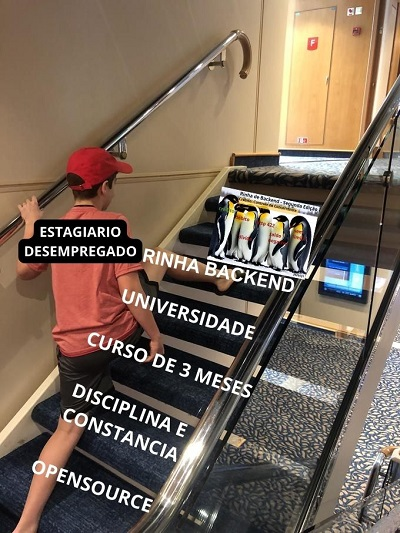

# rinha-backend-2024q1-go

Com muitas lagrimas e sofrimento, tá ai minha versão. Primeira vez usando go em um projeto 🤗

- go
- nginx
- pgxpool
- gofiber
- postgres

[repository](https://github.com/henriiquematheus/rinha-backend-2024q1-go) - [rinha info](https://github.com/zanfranceschi/rinha-de-backend-2024-q1)

[@linkedin](https://www.linkedin.com/in/matheushenrique-dev/)

